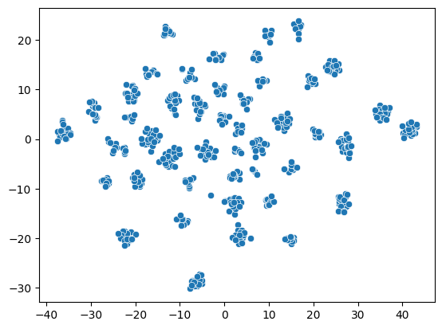

# Machine Learning II Bayesian Unsupervised Methods

This is a notebook based on the EPITA master's program course <Machine Learning II Bayesian & Unsupervised Methods> in 2023.

The *cluster* directory contains an exam project about speed dating data.

The goal is to use any unsupervised technique on the speed_dating.csv to discover its patterns. And the dataset contains the label. The task are described as follow:

    - Explore & preprocess the data: Use any kind of visualization tool as well as any unsupervised method in preference.

    - Explain choices: Why choose this model ? Why choose this number of clusters ? …

    - Organize Notebook and add as many comments as needed: The performance of model will be evaluated.

A heart shape distribution of people in the cluster with highest match rate was found.

## The Modeling

The image bellow shows how the data set looks like. A document is added in the directory to explain the features.

There are 120 features in the original data.

By exploring the data, I can drop 59 of them which are correlated with other features. Thereby reduce the workload for training the model.

I use OneHotEncoder, StandardScaler from sklearn library and CountEncoder from categorical encoder library to build the column transformer with sklearn ColumnTransformer and Pipeline.

Upon it I build a Birch model with sklearn.cluster.Birch.

The number of cluster is set to 16. This number is found after run many times of clustering experiments manually. The elbow rule was tested for searching a good number of clusters with Silhouette Score curve and Calinski-Baraharsz score curve. But with the "best" result I got from the two scores, the data cannot be properly clustered.

The model can correctly find all the cluster while and an anomaly, $4^{th}$ cluster, was detected as we can see from the result with t-SNE feature projection. The green color represent the people has a match where the orange color labeld people have no match.

With the cluster, we can find statistics about the data, such as the matching rate of each cluster. 

(Note that in the figure the $4^{th} - 14^{th}$ clusters are actually the $5^{th}-16^{th}$ clusters in the above figure as the anomaly cluster is removed here ). We can see which cluster has the highest matching rate and which has the least matching rate from the graph.

Then I use RandomForestClassifier to discover the importance of the features.

The same important features also found among the unmatched people. It is logical that the same important features lead to success match and unmatch. This is because the importance is computed to the respect of having a match.

For example the 'attractive_o' and the 'guess_prob_liked' features, the higher the (encoded) values are the higher posibility that people find a match.

Another conclusion we can subtract from the result is that the higher (encoded) 'attractive_o' value is given by the partner, the more likely this person has high score of other important features in the matching cases.

It is very clear that in the matched case, the values of the two features are prone to be in the up right coner.
