# Unsupervised Methods

[[toc]]

## **Why?**

- Most available data is not labelled
- Supervised machine learning algorithms need labels

## Solution?

- To label the unlabelled data
- To use algorithms that do not need any labels (~~and avoiding the costly labelling step~~)

## **What?**

Unsupervised learning are methods to learn when the data does not have any label. It works, *without a supervisor*, to detect new patterns and useful information in data that have or have not any internal relationship.

Unsupervised algorithms can be used on labelled data, the labels are simply ignored or seen as features.

## **Usages?**

- **Customer analysis** and **recommendation systems**
- **Data categorization**, also known as **clustering**
  - News, articles, products...
- **Abnormal instances** (outliers...) detection
  - Frauds, defects...
- **Object recognition in computer vision**
  - Medical analysis...

## **Methods**

- Anomaly Detection
- Association Rules
- Clustering
- Dimensionality Reduction

### Anomaly Detection

Also knon as **Novelty detection**. It trys to find outliers in the data. An outlier can be seen as a **rare or isolated** instance that differs significantly from the remainder of the data.

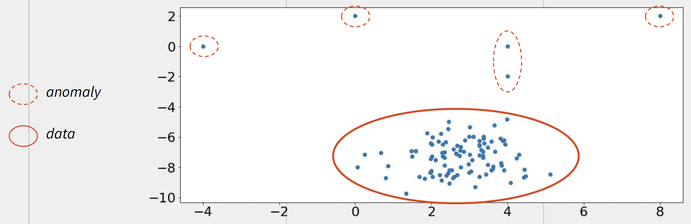

#### Usages:

Fraud detection (credit card frauds ...), dfect detection (defect on a production line ...), medical diagnosis (radiology image analysis ...), cyber security (instrusion detection ...) *etc*.

#### Algorithms

Statistical methods, density-based unsupervised methods, probabilistic methods, data encodings with neural networks...

### Association Rules

It trys to find relations between the features. The relations can be seen as a **set of interesting rules** that determine **how and why certain features are linked**.

#### Usages

Products sale and customer analysis. To find the associations between the produtss.

#### Algorithms

**Most Frequent Sets** (ex., the most frequent set of products purchased together) to find the **next most promising frequent set**.

### Clustering

It trys to create **groups of similar instances** based on the features. Each instance of a dataset is assigned to a group without knowing its label (*its "True" group*)

#### Usages

Customer databases segmentation, medicine, web search, and as a tool for other machine/deep learning algorithms.

#### Algorithms

Clustering algorithms are generally divided into four main categories based on:

- **Connectivity** - which groups the data points that are *close* to each other
- **Centroid** - which groups the data points around a *center point*
- **Distribution** - which groups the data points that appear to belong to the same *probabilistic distribution*
- **Density** - which groups the data points that belong to a high *density area* and treats the other points as outliers

### Dimensionality Reduction

It transform data **from a high dimensional space to a lower one** while keeping as much information as possible.

It is mostly used to visualize data or as a tool for other machine/deep learning model as it reduces the *curse of dimensionality effect* so as to improve the model performances.

#### Algorithms

**Feature Selection** and **Feature Projection**

Feature selection involvs metrics that measures the impact of addition or deletion of a feature. It keeps the other features untouched.

Feature projection is generally replacing the entire set of feature with a smaller one obtained by projecting on a lower dimensional space.

## Dimensionality Reduction

Why do we need dimensionality reduction?

Dimentionality reduction is useful when the goal is to make the data more manageable, improve the performance of machine learning algorithms, or gain a better understanding of the underlying structure of the data.

Particularly, when:

- The data has a lot of **correlated or redundant features**.
- The data is **hard to visualize** because of its high dimensionality
- The number feature is **slowing down** the algorithm

### Curse of Dimensionality

Machine learning project in production usually has thousands or millions of features, which causes two problems:

- It slows down the training
- It may harm the performances because the dimensionality is too large. This problem is also known as the **curse of dimensionality**.

**Curse of Dimensionality**: it refers to the fact that ``as the number of features or dimensions in a dataset increases, the amount of data required to reliably model or analyze that data grows exponentially ``.

In other words, as the number of dimensions increases, the data becomes increasingly sparse, and it becomes more difficult to find meaningful patterns or relationships between the variables.

#### Problems

The **curse of dimensionality** can lead to overfitting, where a model is too complex and fits the training data too closely, but performs poorly on new, unseen data.

It can also make it difficult to visualize or interpret high-dimensional data, since it is difficult to represent more than three dimensions in a meaningful way.

### Feature Projection

Feature projection reduces the dimensionality of the dataset by projecting the data onto a lower-dimensional space.

By projecting the data onto a lower-dimensional space, feature projection can reduce the complexity of the dataset, making it **easier to visualize and analyze**. It can also help to **eliminate noise or redundant information** in the data, **improving the accuracy and efficiency** of machine learning algorithms that are applied to the dataset.

One important consideration when using feature projection is to choose the **appropriate number of dimensions** to project the data onto. This can be determined using techniques such as *scree plots*, *cross-validation*, or other methods for model selection.

Note: **The lower the subspace compared to the original space, the higher is the loss of information**.

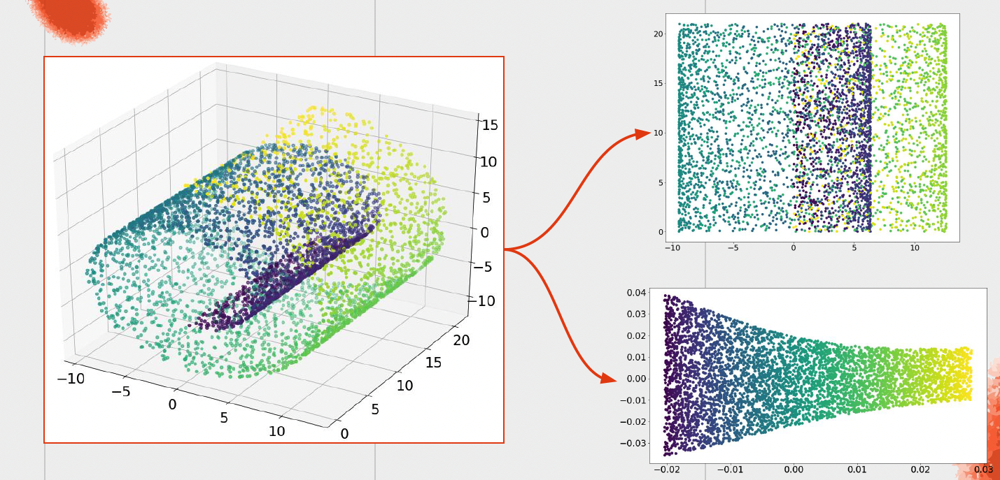

#### Type of Feature Projection

- **Linear Projections**:
  - PCA: Principal Component Analysis
  - NMF: Non-negative Matrix Factorization
  - LDA: Linear Discriminant Analysis
- **Non-Linear Projections**, also known as **Manifold Learning**
  - MDS: Multidimensional Scaling
  - Isometric Mapping
  - LLE: Locally Linear Embedding
  - TSNE: t-distributed Stochastic Neighbor Embedding
  - UMAP: Uniform Manifold Approaximation and Projection
  - Autoencoder: a type of Neural Network
  - kPCA: Kernel Principal Component Analysis
  - ICA: Independent Component Analysis

Popularity (most -> least):

PCA -> TSNE -> Autoencoder -> LDA -> kPCA -> ICA -> NMF

##### Linear Projection Techniques - PCA

###### PCA

- Find the hyperplane
- Project the data on the hyperplane

**$1^{st}$ principal component**: the axis along which we have the largest amount of variance.

**$2^{nd}$ principal component**: the axis is that one orthogonal to the $1^{st}$ principal component. So on so forth for the $3^{rd}$, $4^{th}$ ..., component.

Matrix factorization thechnique **[Singular Value Decomposition](./SVD.md)** (**SVD**) is used to find the principal components. SVD can also be used for data compression, and matrix approximation.

SVD decomposes a matrix $X_{m\times n}$ into three matrices: $X = U\Sigma V^T$ where $X$ is a transformation that maps vectors from an n-dimensional space to an m-dimensional space.

    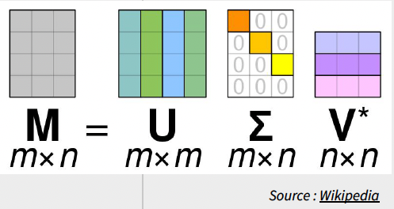

- $U_{m\times m}$ is a **rotation orthonormal-matrix** contains the **singular vectors** of $X$ that forms an orthonormal basis for the **columns of $X$.** It maps the original $n-$dimensional space to a new $m-$dimensional space.
- $\Sigma_{m\times n}$ is a **scaling diagonal-matrix** contains **singular values**. It scales the vectors in this new space along the m principal axes.
- $V^T_{n\times n}$ is a transpose **rotation** matrix of an **orthonormal-matrix**. It maps the sacled vectors back to the original $n-$dimensional space.

The singular values in $\Sigma$ represent the strength of the scaling along the principal axes. The larger the singular value, the more important that axis is in describing the transformation of the matrix $X$.

###### Truncated SVD

Truncated SVD (TSVD) is a variant of SVD.

In contrast to the standard SVD, which decomposes a matrix $X$ into three matrices $U$, $Σ$, and $V^T$, truncated SVD only considers the $k$ largest singular values of $X$ and discards the rest. The truncated SVD then approximates the original matrix $X$ using only the $k$ dominant singular values and their corresponding left and right singular vectors.

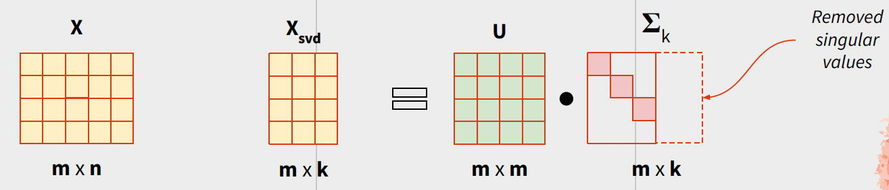

To the respect of dimensionality reduction, each matrix has a different meaning.

The matrix $U$ represents the left singular vectors of the data matrix and is an $m \times k$ matrix. Each column of $U$ represents a linear combination of the original features of the data, and these linear combinations are orthogonal to each other. The first $k$ columns of $U$ represent the $k$ dominant directions in which the data varies the most.

The matrix $Σ$ is a diagonal matrix of size $k \times k$, where $k$ is the number of singular values retained after truncating SVD. The diagonal entries of $Σ$ are the singular values of the data matrix, which represent the strength of each dominant direction. The larger the singular value, the more important the corresponding direction is in explaining the variance in the data.

The matrix $V$ represents the right singular vectors of the data matrix and is an $n \times k$ matrix. Each column of $V$ represents a linear combination of the original data points, and these linear combinations are also orthogonal to each other. The first $k$ columns of $V$ represent the projection of the data onto the k dominant directions identified by $U$.

Together, the matrices $U$, $Σ$, and $V^T$ (transpose of $V$) can be used to reconstruct the original data matrix. Specifically, the truncated SVD of the data matrix $X$ can be written as:

$X ≈ U Σ V^T$

This means that we can approximate $X$ by multiplying the first k columns of $U$, the first $k$ rows and columns of $Σ$, and the first $k$ columns of $V^T$. This approximation can be useful for reducing the dimensionality of the data or for identifying the most important directions along which the data varies.

In short, $U$ contains the principal direction/axis. The $\Sigma V^T$ contains the principal components.

**SVD & TSVD**

The major difference between SVD and TSVD is that the data must be centered before applying SVD.

**Challenges**

There are two main problems in SVD algorithm:

- Very slow, time complexity is $O(n^3)$
- Large memory demands

**Solutions**

*Speed Problem*

**Randomized SVD**: the idea is to use random projections to reduce the dimensionality of the matrix before applying the decomposition

Use case:

- The data is **large** and **sparse**
- The data has a lot of redundant and/or useless features

*Memory Problem*

**Incremental SVD**: also known as **online SVD** or **dynamic SVD**. The idea is to update the SVD of the matrix as new data is added.

Use case:

- Data is large
- Data is being updated frequently

**Pros & Cons of Randomized SVD and Incremental SVD**

Randomized SVD is faster than SVD, with a time complexity of O(n**2k **+ nk**2**), but the quality of the approximate SVD depends on the number of random projection used and degrades as the number of retained singular values decreases. Incremental SVD makes better usage of the memory but the quality of the approximate SVD degrades over time as the number of updates increases.

###### Kernel PCA

Why we need [Kernel PCA](./Kernel SVD.md)?

Traditional PCA works by finding the linear combinations of the input features that capture the maximum variance in the data. The principal components (PCs) are then used to reduce the dimensionality of the data, while retaining as much of the variance as possible. However, traditional PCA may not be effective in cases where the data is non-linearly related, since it only considers linear combinations of the features.

Kernel PCA overcomes this limitation by using a kernel function to **transform the input data into a higher-dimensional feature space**, where the data may be linearly separable. The kernel function allows for non-linear transformations of the input data, making it possible to capture non-linear relationships between the features. Once the data is transformed, traditional PCA is performed on the transformed data to obtain the principal components.

Worth note: **Kernel PCA is computationally more expensive than PCA**

###### Summary

##### Linear Projections Techniques - NMF

[NMF](./NMF.md) (Non-Negative Matrix Factorization) is a group of algorithms that decompose a given matrix into two non-negative matrices.

NMF approximate a matrix $A_{m \times n}$ as a product of two non-negative matrices, $A \approx WH$. The matrix $W$ is often referred to as the 'directory' or 'basis' matrix and contains the basis vectors that make up the lower-dimensional representation of the data.

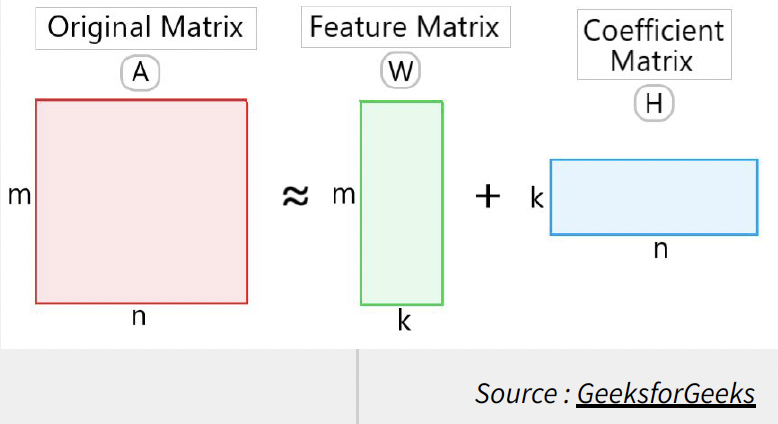

**Usage**

NMF can be used for dimensionality reduction by choosing a maller number of columns in the basis matrix $W$.

NMF is not restricted to dimensionality reduction and is particularly useful for cases where the input data has non-negative values, such as:

- Texte data (topic modeling...)
- Image data (image compression...)
- Audio data (feature extraction...)

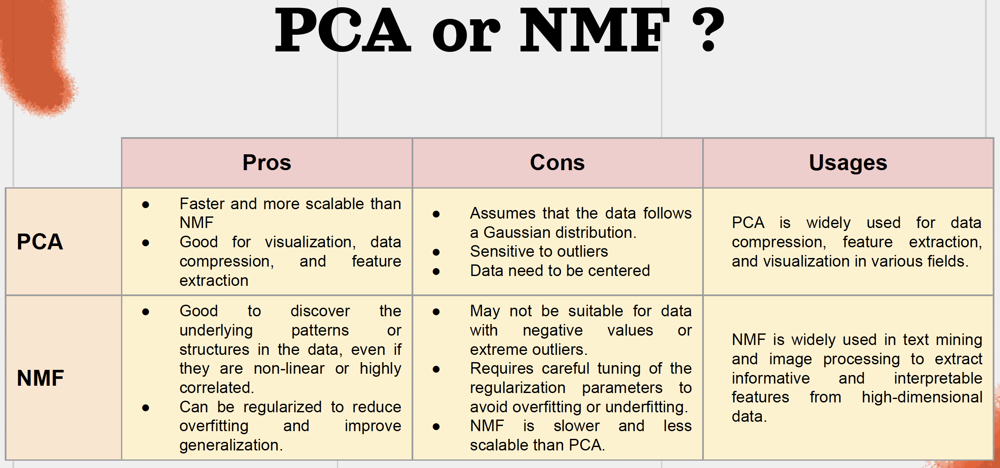

##### Non-Linear Projection Techniques - Manifold Learning

Manifold learning is a set of techniques used in machine learning and data analysis to study and visualize high-dimensional data.

The goal of manifold learning is to uncover the underlying structure or geometry of the data by projecting it onto a lower-dimensional space while preserving as much of the original information as possible.

In essence, a manifold is a mathematical object that can be thought of as a curved surface embedded in a higher-dimensional space. The idea behind manifold learning is that data points that lie close together on the manifold are more similar to each other than data points that are far apart.

Some popular methods include **principal component analysis** (**PCA**), **multidimensional scaling** (**MDS**), **t-distributed stochastic neighbor embedding** (**t-SNE**), and **isometric feature mapping** (**ISOMAP**).

###### MDS

MDS, a technique for dimensionality reduction that creates a low-dimensional representation of a dataset that **preserves the pairwise distances or dissimilarities between the instances.**

The goal of MDS is to find a set of coordinates for each data point in a lower-dimensional space such that the pairwise distances between the points in the lower-dimensional space are as close as possible to the pairwise distances between the original data points in the high-dimensional space. In other words, MDS aims to find a mapping from high-dimensional space to low-dimensional space that preserves the distances between data points.

There are two main types of MDS: **metric MDS** and **non-metric MDS**. Metric MDS assumes that the original distances between the data points are **accurate** and tries to find a mapping that **preserves these distances exactly**. Non-metric MDS, on the other hand, only tries to **preserve the relative ordering of distances** between data points, without assuming that the original distances are accurate.

**Use Case**

It can be used to analyze and visualize data in a way that is easy to understand and interpret.

- psychology
- marketing
- geography

###### ISOMAP

ISOMAP tries to map high-dimensional data onto a lower-dimensional space while preserving the [geodesic distances ](./Geodesic Distances.md)between data points. These geodesic distances are then used to create a weighted graph of the data instances, also known as a neighborhood graph, where the weights on the edges represent the distances between the instances.

Once the graph is constructed, Isomap applies the MDS technique to find a lower-dimensional representation of the data that preserves the pairwise distances as much as possible.

###### LLE

**[Locally Linear Embedding](./Locally Linear Embedding.md)** (**LLE**) is a nonlinear dimensionality reduction technique used in machine learning and data analysis to map high-dimensional data onto a lower-dimensional space while preserving the local structure of the data.

LLE finds a lower-dimensional representation of the data such that each instance in the low-dimensional space is a **linear combination of its closest neighbors** in the high-dimensional space.

To do this, LLE first constructs a graph of the data points, where each point is connected to its k-nearest neighbors. LLE then finds a set of weights for each point that minimizes the difference between the distances between the original data points and the distances between the reconstructed points in the lower-dimensional space.

The reconstruction of each data point is based on a linear combination of its neighboring points, where the weights are chosen to minimize the difference between the distances between the original data points and the distances between the reconstructed points in the lower-dimensional space.

The lower-dimensional representation of the data is then found using classical multidimensional scaling (MDS) or other dimensionality reduction techniques.

Thereby, LLE is sensitive to the choice of the number of nearest neighbors.

**Use case**

- image and speech recognition
- bioinformatics
- data visualization

###### t-SNE

t-distributed stochastic neighbor embedding (t-SNE) is a nonlinear dimensionality reduction technique used to map high-dimensional data onto a lower-dimensional space, typically 2D or 3D, for visualization purposes. t-SNE is particularly useful for visualizing complex, nonlinear relationships between high-dimensional data points.

The basic idea behind t-SNE is to represent each high-dimensional data point as a probability distribution in a low-dimensional space and to minimize the divergence between the distributions in the high-dimensional and low-dimensional spaces.

This is done by first computing a pairwise similarity measure between the data points in the high-dimensional space, typically using a Gaussian kernel. Then, for each data point, t-SNE constructs a probability distribution over the other points in the high-dimensional space, with the similarity values serving as the probabilities.

t-SNE then constructs a similar probability distribution for each data point in the low-dimensional space, and aims to minimize the difference between the high-dimensional and low-dimensional distributions using the Kullback-Leibler (KL) divergence. This involves finding the optimal positions of the data points in the low-dimensional space that minimize the KL divergence, using gradient descent or other optimization algorithms.

###### UMAP

**Uniform Manifold Approximation and Projection** (**UMAP**) is similar to t-distributed stochastic neighbor embedding (t-SNE) in that it is used for visualizing high-dimensional data in a lower-dimensional space, typically 2D or 3D.

UMAP is particularly useful for visualizing complex, nonlinear relationships between data points, and has been shown to be faster and more scalable than t-SNE.

The key idea behind UMAP is to find a low-dimensional representation of the data that preserves the local and global structure of the data. UMAP does this by constructing a fuzzy topological representation of the data in high-dimensional space and then projecting it onto a low-dimensional space using a technique called graph layout.

The basic steps of the UMAP algorithm are as follows:

1. Construct the high-dimensional graph: Compute a nearest-neighbor graph for the data points in high-dimensional space, where each point is connected to its k nearest neighbors.
2. Construct the fuzzy simplicial set: Using the nearest-neighbor graph, construct a fuzzy simplicial set, which is a mathematical object that encodes the local and global structure of the data. This involves constructing a set of simplices, or higher-dimensional triangles, that connect the data points in a way that reflects the density and distribution of the data.
3. Optimize the low-dimensional embedding: Project the fuzzy simplicial set onto a low-dimensional space using graph layout, which is a technique that maps the topology of the high-dimensional graph onto a low-dimensional space while preserving the relationships between neighboring points. This involves minimizing a cost function that balances the preservation of the local and global structure of the data.

##### Compare each non-linear approach

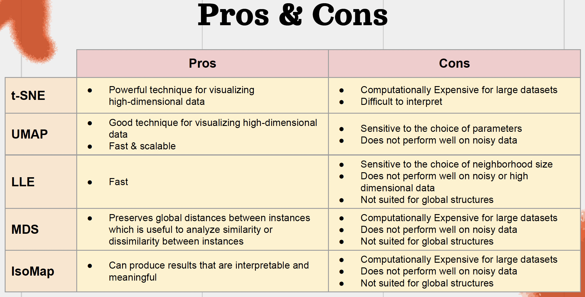

### Clustering

Clustering is a machine learning technique used to group together similar data points based on their characteristics or features. The goal of clustering is to partition a dataset into groups, or clusters, such that the data points within each cluster are similar to each other and dissimilar to data points in other clusters.

**Use Case**

- Market Segmentation
- Recommender Systems
- Image and Speech Recognition
- Natural Language Processing

**Algorithms**:

There are many different types of clustering algorithms, but they can generally be divided into two categories: hierarchical clustering and partitioning clustering.

- Connectivity based clustering
- 

#### Connectivity Based Clustering

Connectivity based clustering is also known as hierarchical clustering, which is based on the idea that objects being more related to nearby objects than to objects farther away.

There are two main approaches:

- Bottum-up: *In this method, all instances start with their own cluster which are gradually merged during the next steps.*
- Top-down: *In this method, all instances are inside one big cluster which is gradually divided during the next steps.*

**The top-down approach works best when there are fewer, but larger clusters. The bottom-up approach works best when there are many smaller clusters.**

To determine the similarity between data distances and distances between the clusters, linkage criteria is used as a distance metric

Mostly used distance: eulicidean distence. Others: Manhattan, Minkowski and Hamming distances.

Main linkage criterias:

- Single Linkage
- Complete Linkage
- Average Linkage
- Ward Linkage

The **Single Linkage** is searching for the closest pair of points to merge or split two clusters.

The **Complete Linkage** criteria is searching for the furthest pair of points to merge or split two clusters.

Th **Average/median Linkage** criteria is searching to minimize the average or median distance of all the pair points to merge or split.

The **Ward Linkage** criteria is considering the union of every possible cluster pair and is trying the **minimize the residual sum of squares between them. It is based on minimizing the variance of the distances between the new clusters and their centroids.

#### Dendrogram

A dendrogram is a type of diagram used to represent the hierarchical clustering of a dataset. The dendrogram algorithm is used to construct this diagram, and it works by recursively merging pairs of clusters until a single root cluster is formed.

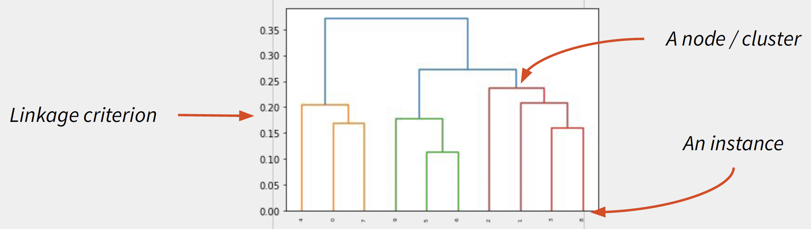

One can cut the dendrogram based on the number of clusters or a threshold of similarity to create a flat clustering.

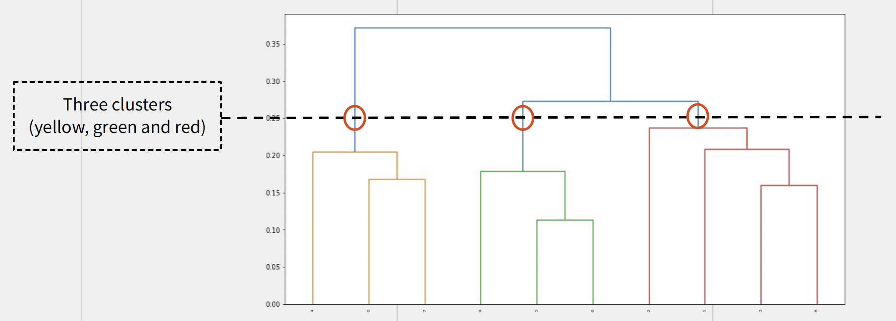

##### Pros and Cons

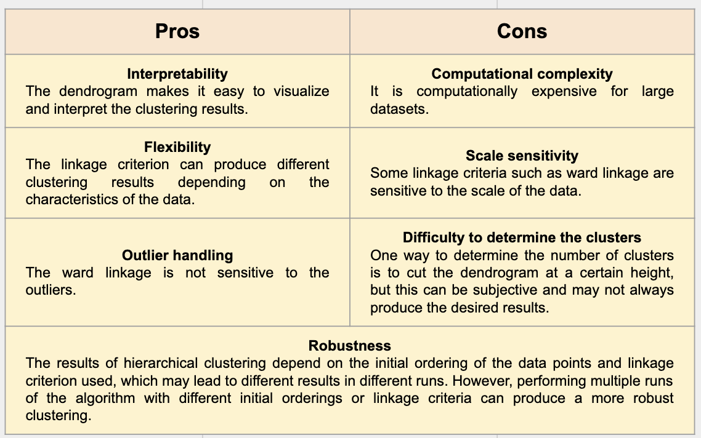

#### BIRCH

BIRCH stands for **Balanced Iterative Reducing and Clustering using Hierachies**. It uses a **[Cluster Feature tree](./Cluster Feature tree.md)** (CF) to *incrementally* build a hirachical clustering structure.

BIRCH is efficient in handling large and dynamic data sets without having to store all the data in memory. Because BIRCH constructs CF tree incrementally as data is being processed. The instances are added to the tree one at a time, and so that the tree is updated each time.

##### Pros and Cons

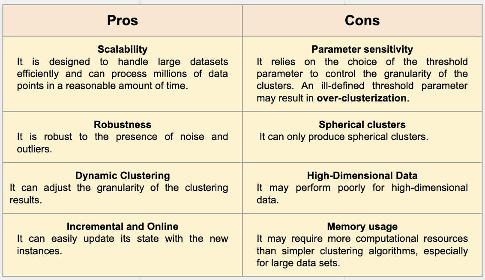

#### Centroid based clustering

Commonly used Algo.:

- **K-means**
- **K-medians**: using the dedian instead of the mean
- **K-medoids**: using an instance as centroid instead of the mean
- **Fuzzy c-means**: instances can belong to multiple clusters

##### K-Means

It partitions a dataset into k clusters, each cluster is represented by its centroid which is the mean of all the points in the cluster.

Steps:

- Initialization: initialize the centroids of k clusters
- Iteration: based on the closest distrance between instance and centroids of clusters, assign the instance to the correct cluster of which the centroid is updated with the new instance added.

K-means is sensitive to the itnitial placement of centroids.

Few techniaues are used for determining the number of clusters:

- **Elbow method**
- **Silthouette analysis**
- **Calinski-Harabasez index**

###### Elbow Method

This method determines the value of k by choosing the value at which the sum of squared distances between the instances and their respective cluster centroid to the respect of k increases with a slower rate.

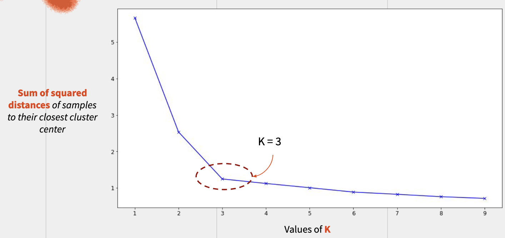

###### Silhouette Analysis

This method calculates the silhouette score for each instance which measures the similarity of an instance to its own cluster compared to other clusters.

- The average distance between an instance $i$ and all other instances in the same cluster, denoted as $a(i)$
- Next,it calculates the minimum of the average distance between an instance $i$ and all other instances in the nearest different cluster, denoted as $b(i)$

  $$
  a(i) = \frac{1}{C_I - 1}\sum_j d(i, j)\;\;\;\;\; b(i) = min\Bigg(\frac{1}{C_J}\sum_j d(i,j) \Bigg)
  $$

  where $I$ is the cluster of instance $i$ and $J$ a different cluster, $C_I$ and $C_J$ the number of instances in clusters $I$ and $J$, $d(i, j)$ the distance between instances $i$ and $j$.
- The silhouette score for each instance $i$:

  $$
  s(i) = \frac{b(i) - a(i)}{max(a(i), b(i))}
  $$
- The silhouette score for each cluster is the *average of all its instances' silhouette scores* $s(i)$:

  $$
  s = \frac{1}{N}\sum_i^Ns(i)
  $$

The silhouette score ranges from -1 to 1:

- a high score ($\to$ 1) indicates the data is well-matched to its own cluster
- a score ($\to$ 0) indicates overlapping clussters.
- a low score ($\to$ -1) indicates that the data point is poorly matched to its own cluster.

The correct number of clusters is typically chosen as the number of clusters that results in the highest average silhouette score.

###### Clinski Harabasz

Clinski-Harabasz index is also know as the **Variance Ratio Criterion**.

This is an algorithm to evaluate a clustering solutions and to estimate the correct number of clusters in a k-means algorithm.

By comparing the ratio of between-cluster variance to the within-cluster variance for different values of $k$, it find the coorect value $k$ that maximize this ratio.

$$
S_{CH} = \frac{(N-K)B}{(K-1)\sum_{k=1}^KW_k}
$$

Where $N$ is the number of instances, $K$ is the number of clusters, $B$ is the inter-cluster variance, $W_k$ is the intra-cluster variance.

here is the bottom
